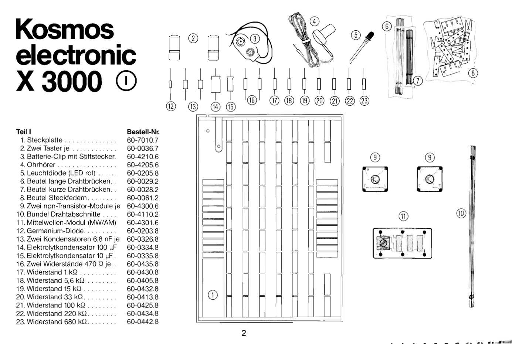

# Bill of Materials X1000 (Box I)

| Nr  | Description            | Alternative            | Package                | Unit Price             |  Bulk Price            |
| --- | ---------------------- | ---------------------- | ---------------------- | ---------------------- | ---------------------- |
| 1.  | Main Board                | TODO: 3D Design | | | |
| 2.  | Switch (x2)            | [↓](#switch-module) | | | |
| 3.  | ✅ 9V Battery Clip     | [9V Battery Clip](https://akizukidenshi.com/catalog/g/gP-00452/) 🅰️[^1] 1F06 | | ¥20 | |
| 4.  | Earpiece, 8Ω           | TODO: Find with Crystal Radio Set | | | |
| 5.  | ✅ Red LED, 5mm           | [Red LED, 5mm](https://akizukidenshi.com/catalog/g/gI-06245/) 🅰️[^1] 1F25/2 | Through-Hole | ¥12 | ¥120 for 10 |
| 6.  | ✅ Long Wires             | [Wire Set](https://akizukidenshi.com/catalog/g/gP-05160/)| | ¥400 | |
| 7.  | Short Wires            | See 6. | | | |
| 8.  | ✅ Pin Headers 1x4, 2.54mm, Black | [Pin Header 1x4](https://akizukidenshi.com/catalog/g/gC-10099/) 🅰️[^1] 1F12/下, C-10099| Through-Hole | ¥20 |  |
| 8.A  | Pin Headers 1x40, 2.54mm, Red, Yellow, Gray, Green | ✅ [Pin Header 1x40](https://akizukidenshi.com/catalog/g/gC-10299/), 🅰️[^1]1F12/下, C-10299 | Through-Hole | ¥100 | ¥10 for 1x4 |
| 8.B  | Pin Headers 1x40, 2.54mm, Black | ✅ [Pin Header 1x40](https://akizukidenshi.com/catalog/g/gC-10073/) 🅰️[^1] 1F12/下, C-10073| Through-Hole | ¥80 | ¥8 for 1x4 |
| 9.  | NPN Transitor Module (x2) | [↓](#npn-transistor-module) | | | |
| 10. | Very Long Wires        | See 6. | | | |
| 11. | [MW/AM Module](https://www.rigert.com/ee-wiki/index.php?title=KOSMOS_Mittelwellen-Modul) | [↓](#mw-am-module) | | | |
| 12. | Diode (Germanium), AA112, AA118, 1N60, AA113 |⚠️ [1N60](https://akizukidenshi.com/catalog/g/gI-05507/) 🅰️[^1] 1F21/2, I-05507 | Through-Hole | ¥25 | 10 for ¥250 |
| 13.A | Capacitor 6.8nF (x2)   | ⚠️ [6800pF50V X7R 5mm](https://akizukidenshi.com/catalog/g/gP-08137/) 🅰️[^1] 1F22/2, P-08137 | Through-Hole, Radial (x10) | ¥10 | ¥100 |
| 13.B | Capacitor 6.8nF (x2)   | ⚠️ [XICON 23PS268 Styrofoam Capacitor 50V6800pF](https://www.sengoku.co.jp/mod/sgk_cart/detail.php?code=EEHD-4ET7#) 💎[^3] | Through-Hole, Axial | ¥111 | |
| 14.A | Capacitor 100µF, bi-polar, axial | ⚠️ [107BPA016M](https://www.digikey.jp/en/products/detail/cornell-dubilier-illinois-capacitor/107BPA016M/5410731) 🔑[^2] | Through-Hole, Axial | ¥198 | |
| 14.B | Capacitor 100µF, bi-polar | ⚠️ [100µF16V](https://akizukidenshi.com/catalog/g/gP-10271/) 🅰️[^1] 1F09/下, P-10271 | Through-Hole | ¥20 | |
| 14.C | Capacitor 100µF, bi-polar, axial | ⚠️ [100µF50V, UNICON GST1H101M](https://www.sengoku.co.jp/mod/sgk_cart/detail.php?code=EEHD-0GMP) 💎[^3] | Through-Hole | ¥105 | |
| 15.A | Capacitor 10µF, bi-polar, axial | ⚠️ [106BPA050M](https://www.digikey.jp/en/products/detail/cornell-dubilier-illinois-capacitor/106BPA050M/5410614) 🔑[^2] | Through-Hole, Axial | ¥150 | |
| 15.B | Capacitor 10µF, bi-polar | ⚠️ [10µF25V](https://akizukidenshi.com/catalog/g/gP-17877/) 🅰️[^1]1F09/下, P-17877 | Through-Hole | ¥20 | |
| 15.C | Capacitor 10µF, bi-polar, axial | ⚠️ [10µF50V, UNICON GST1H100M](https://www.sengoku.co.jp/mod/sgk_cart/detail.php?code=EEHD-0GMK) 💎[^3] | Through-Hole | ¥105 | |
| 16. | Resistor 470Ω (x2)     | ✅ [1/2W 470Ω](https://akizukidenshi.com/catalog/g/gR-07814/) | Through-Hole, Axial (x100) | ¥1 | ¥100 |
| 17. | Resistor 1㏀           | ✅ [1/2W 1㏀](https://akizukidenshi.com/catalog/g/gR-07820/) | Through-Hole, Axial (x100) | ¥1.5 | ¥100 |
| 18. | Resistor 5.6㏀         | ✅ [1/4W 5.6㏀](https://akizukidenshi.com/catalog/g/gR-25562/) | Through-Hole, Axial (x100) | ¥1 | ¥100 |
| 19. | Resistor 15㏀          | ✅ [1/2W 15㏀](https://akizukidenshi.com/catalog/g/gR-07840/) | Through-Hole, Axial (x100) | ¥1 | ¥100 |
| 20. | Resistor 33㏀          | ✅ [1/2W 33㏀](https://akizukidenshi.com/catalog/g/gR-07812/) | Through-Hole, Axial (x100) | ¥1 | ¥100 |
| 21. | Resistor 100㏀         | ✅ [1/2W 100㏀](https://akizukidenshi.com/catalog/g/gR-07853/) | Through-Hole, Axial (x100) | ¥1 | ¥100 |
| 22. | Resistor 220㏀         | ✅ [1/2W 220㏀](https://akizukidenshi.com/catalog/g/gR-07858/) | Through-Hole, Axial (x100) | ¥1 | ¥100 |
| 23. | Resistor 680㏀         | ✅ [1/4W 680㏀](https://akizukidenshi.com/catalog/g/gR-25684/) | Through-Hole, Axial (x100) | ¥1 | ¥100 |

### General
| Nr  | Description            | Alternative            | Package                | Unit Price             |  Bulk Price            |
| --- | ---------------------- | ---------------------- | ---------------------- | ---------------------- | ---------------------- |
| X  | Pin Headers 1x40 (x10)  | ⚠️ [Color Pin Headers](https://akizukidenshi.com/catalog/g/gC-06641/) 🅰️[^1]1F12/下, C-06641 | | ¥550 | ¥1.375 for 1 |
| X  | L-Pin Sockets 1x6       | ✅ [L-Pin Sockets](https://akizukidenshi.com/catalog/g/gC-03795/) 🅰️[^1]1F12/下, C-03795 | | ¥20 | |

### Switch Module
| Nr  | Description            | Alternative            | Package                | Unit Price             |  Bulk Price            |
| --- | ---------------------- | ---------------------- | ---------------------- | ---------------------- | ---------------------- |
| 2.1  | SMD Switch (x2)       | SMD Switch | | | |
| 2.2  | Module PCB            | TODO: Design & Mill PCB Design | | | |

### NPN Transistor Module
| Nr  | Description            | Alternative            | Package                | Unit Price             |  Bulk Price            |
| --- | ---------------------- | ---------------------- | ---------------------- | ---------------------- | ---------------------- |
| 9.1A  | NPN Transitor Module, BC583C, BC238C, BC548C BJT 100mA 30V NPN | ⚠️ [BC848BLT1G](https://www.digikey.jp/en/products/detail/onsemi/BC848BLT1G/918348) 🔑[^2] | SOT23-3 | ¥21 | ¥42 |
| 9.1B  | NPN Transitor Module 100mA 60V | ⚠️ [2PD601AR 50V100mA](https://akizukidenshi.com/catalog/g/gI-02231/) 🅰️[^1]NA, Online Only | SOT23 | 0.625¥ | 80 for ¥50 |
| 9.1C  | NPN Transitor Module 100mA 60V | ⚠️ [2SC3324-GR 120V100mA](https://akizukidenshi.com/catalog/g/gI-09371/) 🅰️[^1]1F23/4, I-09371 | SC-59 | 25¥ | 5 for ¥150 |
| 9.2  | Module PCB            | TODO: Design & Mill PCB Design | | | |

### MW/AM Module
| Nr  | Description            | Alternative            | Package                | Unit Price             |  Bulk Price            |
| --- | ---------------------- | ---------------------- | ---------------------- | ---------------------- | ---------------------- |
| 11.1 | Toko RCL XYRS 18194 N5 86152 | ⚠️ [Murata](https://www.digikey.jp/en/products/detail/murata-electronics/A1313B-0029GGH-P3/13244738) | 6-SMD | ¥226 |  |
| 11.2  | Capacitor 15pF | ⚠️ [15pF50V](https://akizukidenshi.com/catalog/g/gP-13312/) | 1608 | 2.5¥ | 40 for 100¥ |
| 11.2A  | Capacitor 15pF | ⚠️ [15pF250V](https://www.sengoku.co.jp/mod/sgk_cart/detail.php?code=EEHD-5S3X#) | 3216 | 10¥ | 50 for 500¥ |
| 11.3  | Capacitor 47pF | ⚠️ [47pF50V](https://akizukidenshi.com/catalog/g/gP-17481/)| 1608 | 2.5¥ | 40 for 100¥ |
| 11.3A  | Capacitor 47pF | ⚠️ [47pF250V](https://www.sengoku.co.jp/mod/sgk_cart/detail.php?code=EEHD-5PLJ) | 3216 | 10.5¥ | 50 for 525¥ |
| 11.4  | Capacitor 100pF | ⚠️ [100pF50V](https://akizukidenshi.com/catalog/g/gP-16524/) | Through-Hole | 6¥ | 10 for 60¥ |
| 11.4A  | Capacitor 100pF | ⚠️ [100pF50V](https://www.sengoku.co.jp/mod/sgk_cart/detail.php?code=EEHD-58F3) | 3216 | 35.8¥ | 5 for 179¥ |

Notes:
- Find 3216 SMDs instead of 1608
- https://www.eevblog.com/forum/projects/can-someone-identify-this-toko-rcl-component/
- https://www.boehri.de/elektronik/AM_Testsender_Kosmos_electronic_X1000.pdf
- https://www.murata.com/en-global/products/inductor/variable

[^1]: Akizuki Denshi
[^2]: Digikey
[^3]: Sengoku

