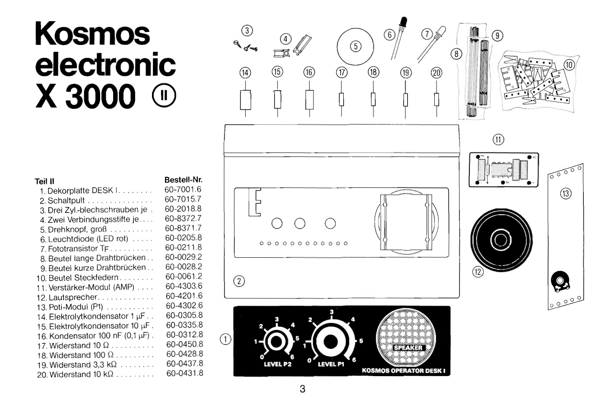
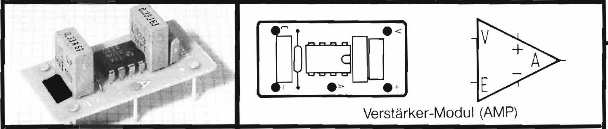

# Bill of Materials X2000 (Box II)

# ✅

| Nr  | Description            | Alternative            | Package                | Unit Price             |  Bulk Price            |
| --- | ---------------------- | ---------------------- | ---------------------- | ---------------------- | ---------------------- |
| 1.  | Decoration Plate       | TODO: 2D Design & Lasercut | | | |
| 2.  | Console                | TODO: 3D Design | | | |
| 3.  | ⚠️ Screws                 | | | | |
| 4.  | Connecting Rods        | TODO: 3D Design | | | |
| 5.  | Knob, Large            | [Black, 15mm](https://akizukidenshi.com/catalog/g/gP-00253/), [Grey, Blue](https://akizukidenshi.com/catalog/g/gP-06091/)[^1] | | | |
| 6.A  | ✅ Red LED, 5mm           | [RED LED, 5mm](https://akizukidenshi.com/catalog/g/gI-06245/)[^1] 🅰️[^1]1F25/2, I-06245 | Through-Hole | ¥12 | ¥120 for 10 |
| 6.B  | ⚠️ Red LED, 3mm           | [RED LED, 3mm](https://akizukidenshi.com/catalog/g/gI-11577/)[^1], 🅰️[^1]1F25/2, I-11577 | Through-Hole | ¥10 |  |
| 7.A  | ⚠️ Photo Transistor, 560nm     | [Photo Transistor](https://akizukidenshi.com/catalog/g/gI-02325/)[^1] 🅰️[^1]1F18/5, I-02325 | Through-Hole | ¥50 | ¥100 for 2 |
| 7.A  | ⚠️ Photo Transistor, 3mm, 440 to 800 nm   | [Photo Transistor](https://www.sengoku.co.jp/mod/sgk_cart/detail.php?code=EEHD-4HXG)[^3] 🅰 | Through-Hole | ¥84 |  |
| 7.C  | ⚠️ Photo Transistor TF, 5mm, clear, BPW40| [WP7113P3C](https://www.digikey.jp/en/products/detail/kingbright/WP7113P3C/7318904)[^2] | Through-Hole | ¥60 | |
| 8.  | ✅ Long Wires             | See Box I.6 | | | |
| 9.  | ✅ Short Wires            | See Box I.6 | | | |
| 10. | ✅ Pin Headers 1x4, 2.54mm x 9 x 7 | See Box I.8  | Through-Hole | ¥20 |  |
| 11. | [AMP](https://www.rigert.com/ee-wiki/index.php/KOSMOS_Verstärker-Modul) Amplication Module | [↓](#amp-module) | | | |
| 12.A | ✅ Speaker, ⌀50mm[^4], 8Ω | [⌀28mm, 8Ω](https://akizukidenshi.com/catalog/g/gP-09013/) 🅰️[^1]2F/73, P-09013| | ¥180 | |
| 12.B | ⚠️ Speaker, ⌀28mm, 8Ω | [⌀28mm, 8Ω](https://akizukidenshi.com/catalog/g/gP-12587/) 🅰️[^1]1F/05, P-12587| | ¥190 | |
| 13.  | ⚠️ Potentiometer Module (P1)[^5]  10KΩ lin. (B) | [10ＫΩＢ](https://akizukidenshi.com/catalog/g/gP-15813/) 🅰️[^1]1F33, P-15813 | | ¥60 | |
| 14.  | ⚠️ Capacitor 1µF, bi-polar, axial | [GST1H1R0M, 1µF50V](https://www.sengoku.co.jp/mod/sgk_cart/detail.php?code=EEHD-0GMG) 💎[^3] | Through-Hole, Axial |¥105 | | 
| 15.  | ⚠️ Capacitor 10µF, bi-polar, axial | see Box I.14  | | | | 
| 16.  | ⚠️ Capacitor 100nF, 0.1µF | [FYU6104Z6 50V 0.1μF](https://www.sengoku.co.jp/mod/sgk_cart/detail.php?code=EEHD-06D3) 💎[^3] | Through-Hole | | | 
| 17. | ✅ Resistor 10Ω          | [1/4W 10Ω](https://akizukidenshi.com/catalog/g/gR-07805/)  | Through-Hole, Axial (x100) | ¥1 | ¥100 for 100|
| 18. | ✅ Resistor 100Ω         | [1/4W 100Ω](https://akizukidenshi.com/catalog/g/gR-07805/)  | Through-Hole, Axial (x100) | ¥1 | ¥100 for 100|
| 19. | ✅ Resistor 3.3㏀         | [1/4W 3.3㏀](https://akizukidenshi.com/catalog/g/gR-25103/)  | Through-Hole, Axial (x100) | ¥1 | ¥100 for 100 |
| 20. | ✅ Resistor 10㏀          | [1/4W 10㏀](https://akizukidenshi.com/catalog/g/gR-25223/)  | Through-Hole, Axial (x100) | ¥1 | ¥100 for 100 |

### AMP Module

| Nr  | Description            | Alternative            | Package                | Unit Price             |  Bulk Price            |
| --- | ---------------------- | ---------------------- | ---------------------- | ---------------------- | ---------------------- |
| 11.1 | ⚠️ Film Capacitor 330pF, 100V, WIMA | [330pF 63V WIMA](https://www.sengoku.co.jp/mod/sgk_cart/detail.php?code=EEHD-4ETP) 💎[^3] | Through Hole | ¥69|  |
| 11.2 | ⚠️ 2x Film Capacitor 330nF = 0.33µF, 63V, WIMA MKS-4 | [MKS2 63V 0.33μF](https://www.sengoku.co.jp/mod/sgk_cart/detail.php?code=EEHD-0GN5) 💎[^3] | Through Hole | ¥105 | |
| 11.3 | ✅ Resistor 10Ω | See 17| Through-Hole | | |
| 11.4 | ✅ IC [TBA820](https://www.st.com/resource/en/datasheet/cd00000118.pdf) | [TBA820M](https://akizukidenshi.com/catalog/g/gI-17301/) 🅰️[[^1] | DIP-8 | ¥30 |  |
| 11.5 | Module PCB, Through Hole Design | PCB Design & Mill | | | |

[^1]: Akizuki Denshi
[^2]: Digikey
[^3]: Sengoku
[^4]: ⌀50mm is too large for Mini Console
[^5]: [E200_Bauteile](https://www.rigert.com/ee-wiki/index.php?title=KOSMOS_E200_Bauteile)
