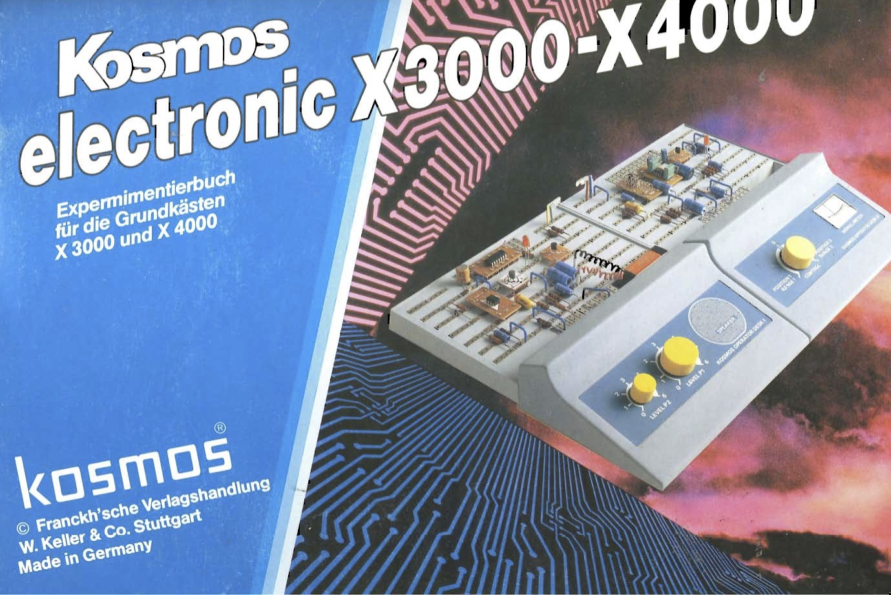

# 宇宙 Uchi Mini X4000

The 宇宙 (うちゅう, uchū) "Kosmos" Mini X4000 is a re-imagination of a popular Kosmos Electronics construction kits ("[Experimentierkasten](https://de.wikipedia.org/wiki/Experimentierkasten)") from th 1980ies.

I still have the instruction books for the X1000-X2000 and X3000-X4000 sets, but I only every got the X2000 and the X2500 Extenstion Set, I could make all the experiments up to the X3000, but not the X4000.

With this re-making of the complete set, I'll finally be able to make **all** the experiments!

The Kosmos X-Series was followed by the XN-Series, which introduces a different chassis and some addtional parts (Variable Capacitor, 555 Timer)

## Todo
- [X] Identify the parts and create a complete [BoM (Bill of Materials)](BoM.md)
- [ ] Find where to source the parts - and how much they cost
- [ ] PCB Design the Main Board
- [ ] PCB Design the small carrier boards for IC, AMPs, etc
- [ ] Mill the Boards
- [ ] 3D Model the Console ("Schaltpult") & Enclosures
- [ ] 3D Print the Console & Enclosures
